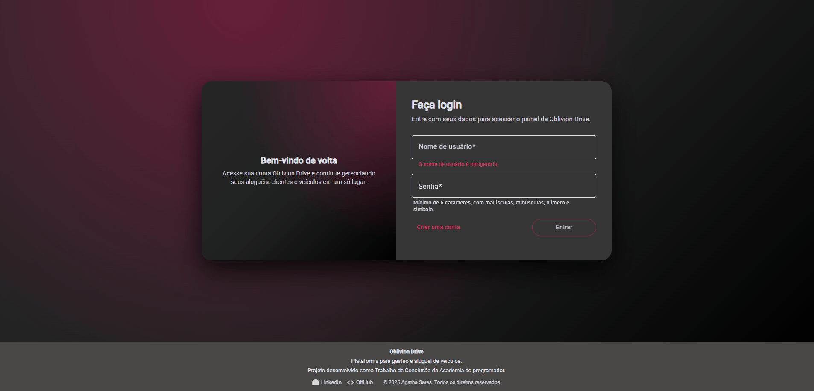
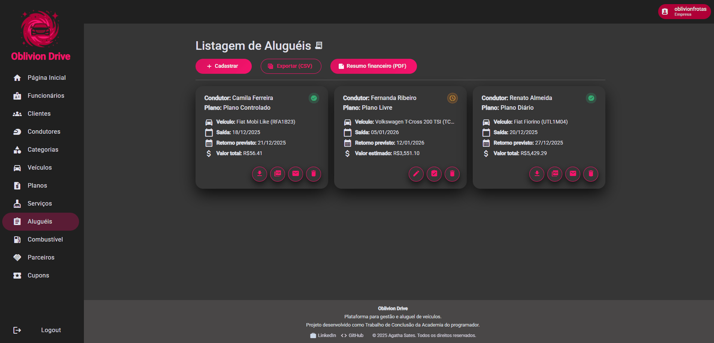
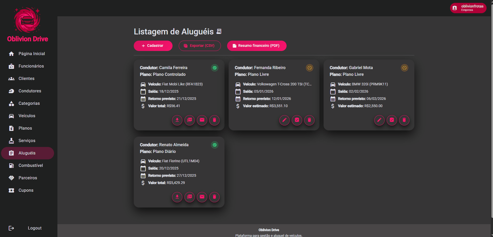
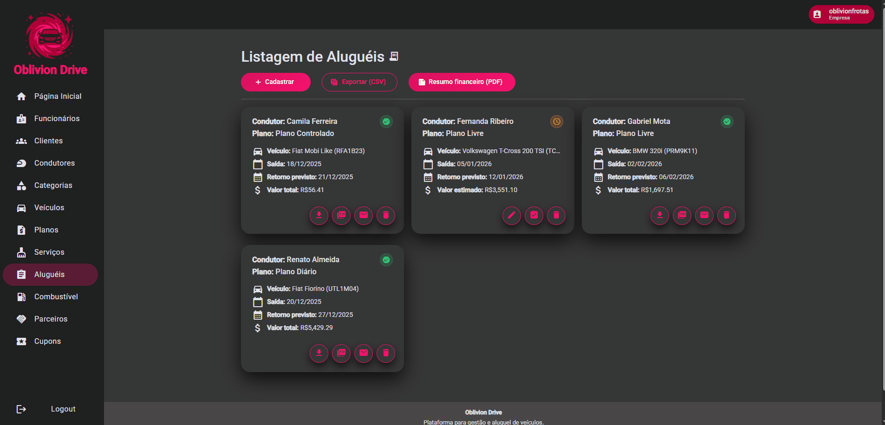

# OblivionDrive

# 📌 Demonstração

## 🔐 Login e Página Inicial


## 🧭 Navegação entre Módulos



## 🚗 Cadastro de Aluguel



## 🧾  Devolução e emissão da Nota Fiscal



## 📊 Envio por E-mail e Relatório financeiro



# 💡 Índice

- [Demonstração](#-demonstração)
- [Introdução](#-introdução)
- [Funcionalidades](#-funcionalidades)
- [Estrutura do Projeto](#-estrutura-do-projeto)
- [Tecnologias Usadas](#-tecnologias-usadas)
- [Commits e Convenções](#-commits-e-convenções)
- [Contribuidores](#-contribuidores)
- [Mentores](#-mentores)
- [Sobre o Projeto](#-sobre-o-projeto)

# 🚘 Introdução

O **OblivionDrive** é uma aplicação fullstack para **gestão de uma locadora de veículos**, estruturada para funcionar em modelo **multi-tenant** (múltiplas empresas/filiais/locadoras no mesmo sistema, com isolamento de dados por tenant), com foco em:

- gestão de **clientes** (PF/PJ) e **condutores**;
- gestão de **veículos** e **grupos de veículos**;
- cadastro e controle de **aluguéis** (retirada e devolução);
- configuração de **planos**, **cupons** e **serviços adicionais**;
- geração de documentos e relatórios em **PDF** (nota fiscal e resumo/relatório financeiro).

O projeto foi organizado por módulos tanto no front-end (Angular) quanto no back-end (.NET), e eu considero essa divisão essencial para manter o domínio legível e evoluir features sem virar “código alfabeto”.

# ✨ Funcionalidades

- 🧩 **Multi-tenant (Locadora por Tenant)**  
  Estrutura preparada para operar com múltiplas locadoras no mesmo sistema, mantendo **isolamento** e organização por tenant.

- 🔐 **Autenticação e autorização (Auth)**  
  Módulo dedicado para login e controle de acesso (front e back separados por camadas/módulos).

- 🚗 **Gestão de Aluguéis (Rental)**  
  Fluxo completo para **cadastrar**, **listar**, **editar**, **excluir**, **registrar retirada** e **registrar devolução**.

- 👤 **Gestão de Clientes e Condutores**  
  Cadastro e administração de clientes, incluindo condutores vinculados quando aplicável.

- 🧾 **Emissão de Nota Fiscal em PDF**  
  Geração da **Nota Fiscal** em PDF diretamente pelo sistema.

- 📧 **Envio do e-mail da Nota Fiscal**  
  Envio da Nota Fiscal (PDF) por **e-mail**, centralizando o fluxo de pós-locação.

- 📊 **Relatório / resumo financeiro em PDF**  
  Emissão de relatório financeiro em PDF para apoiar gestão e acompanhamento de resultados.

- ⚙️ **Módulos de apoio à operação**  
  - 📦 **Planos de Cobrança (Billing Plans)**
  - 🎟️ **Cupons (Coupon)**
  - 🧰 **Serviços adicionais (Services)**
  - ⛽ **Configuração de preço de combustível (Fuel Price Configuration)**
  - 🤝 **Parceiros (Partners)**
  - 🚙 **Veículos e Grupos de Veículos (Vehicle / Vehicle Groups)**
  - 👥 **Funcionários (Employee)**

# 🧱 Estrutura do Projeto

```text
OblivionDrive
│
├── .github
│
├── client
│   ├── .angular/
│   ├── public/
│   └── src/
│       ├── app/
│       │   ├── components/
│       │   │   └── home/
│       │   │
│       │   ├── modules/
│       │   │   ├── auth/
│       │   │   ├── billing-plans/
│       │   │   ├── client/
│       │   │   ├── coupon/
│       │   │   ├── driver/
│       │   │   ├── employee/
│       │   │   ├── fuel-price-configuration/
│       │   │   ├── partners/
│       │   │   ├── rental/
│       │   │   │   ├── models/
│       │   │   │   ├── pages/
│       │   │   │   │   ├── delete/
│       │   │   │   │   ├── edit/
│       │   │   │   │   ├── list/
│       │   │   │   │   ├── register/
│       │   │   │   │   └── return/
│       │   │   │   ├── services/
│       │   │   │   └── rental.routes.ts
│       │   │   ├── services/
│       │   │   ├── vehicle/
│       │   │   └── vehicle-groups/
│       │   │
│       │   ├── shared/
│       │   ├── data/
│       │   │   ├── navbar-items.data.ts
│       │   │   └── review-items.data.ts
│       │   ├── models/
│       │   │   ├── navbar-item.ts
│       │   │   └── review-item.ts
│       │   ├── app.config.ts
│       │   ├── app.html
│       │   └── app.ts
│       │
│       ├── environments/
│       ├── styles/
│       └── index.html
│
└── server
    ├── Api/
    │   ├── AutoMapper/
    │   ├── Controllers/
    │   ├── Helpers/
    │   ├── Identity/
    │   ├── Models/
    │   ├── Properties/
    │   ├── ApiDependencyInjection.cs
    │   ├── appsettings.Development.json
    │   ├── appsettings.json
    │   ├── OblivionDrive.Api.csproj
    │   └── Program.cs
    │
    ├── Application/
    │   ├── AuthenticationModule/
    │   ├── AutoMapper/
    │   ├── BillingPlanModule/
    │   ├── ClientModule/
    │   ├── CouponModule/
    │   ├── DriverModule/
    │   ├── EmployeeModule/
    │   ├── FluentValidation/
    │   ├── FuelPriceConfigurationModule/
    │   ├── PartnerModule/
    │   ├── RentalModule/
    │   ├── ServicesModule/
    │   ├── Shared/
    │   ├── VehicleGroupModule/
    │   └── VehicleModule/
    │
    ├── Domain/
    │   ├── AuthenticationModule/
    │   ├── BillingPlanModule/
    │   ├── ClientModule/
    │   ├── CouponModule/
    │   ├── DriverModule/
    │   ├── EmployeeModule/
    │   ├── FuelPriceConfigurationModule/
    │   ├── PartnerModule/
    │   ├── RentalModule/
    │   ├── ServicesModule/
    │   ├── Shared/
    │   ├── VehicleGroupModule/
    │   ├── VehicleModule/
    │   └── OblivionDrive.Domain.csproj
    │
    ├── Infrastructure/
    ├── Tests.Integration/
    ├── Tests.Unit/
    └── OblivionDrive.sln
```

- 🧩 **Client (Angular)**  
  Organizado por módulos (modules/*) e com o fluxo de aluguel bem explícito em rental/pages/* (register, list, edit, delete, return).

- 🧠 **Server (API + Application + Domain)**  
  Separação por camadas e módulos no back-end:

    Api: entrada HTTP (Controllers), Identity e configuração
    
    Application: casos de uso, validações e mapeamentos (ex.: FluentValidation, AutoMapper)
    
    Domain: modelo de domínio por módulo (Rental, Vehicle, Client, etc.)


- 🔌 **Tests (Unit e Integration)** 
  Estrutura dedicada para testes, permitindo validar o comportamento do sistema com foco em confiabilidade.

# 🔧 Tecnologias Usadas

- ⚡ **Angular** — componentes standalone + Angular Router  
- 🟦 **TypeScript** — tipagem forte em models e serviços  
- 🔁 **RxJS** — controle reativo de fluxos de dados e eventos  
- 🎨 **SCSS** — estilos globais e utilitários  
- ✅ **ESLint** — padronização de código (`eslint.config.mts`)
- 🧩 **.NET / C#** — back-end estruturado por camadas e módulos
- 🌐 **ASP.NET Core Web API** — endpoints e autenticação
- 🗺️ **AutoMapper** — mapeamentos na API/Application
- ✅ **FluentValidation** — validações no back-end
  
# 🧠 Commits e Convenções

É utilizado [Conventional Commits](https://www.conventionalcommits.org/pt-br/v1.0.0/) para padronizar as mensagens de commit.

# 👥 Contribuidores

<p align="left">
  <a href="https://github.com/AgathaSates">
    
    &nbsp;&nbsp;&nbsp;
  </a>
</p>

| Nome         | GitHub                                         |
| ------------ | ---------------------------------------------- |
| Agatha Sates | [@AgathaSates](https://github.com/AgathaSates) |

# 👨‍🏫 Mentores

<p align="left" style="margin-left: 27px;">
  <a href="https://github.com/tiagosantini">
    
  </a>
  &nbsp;&nbsp;&nbsp;
  <a href="https://github.com/alexandre-rech-lages">
    
  </a>
</p>

| Nome           | GitHub                                                     |
| -------------- | ---------------------------------------------------------- |
| Tiago Santini  | [@Tiago Santini](https://github.com/tiagosantini)          |
| Alexandre Rech | [@Alexandre Rech](https://github.com/alexandre-rech-lages) |

# 🏫 Sobre o Projeto

Desenvolvido durante o curso Fullstack da [Academia do Programador](https://academiadoprogramador.net) 2025
